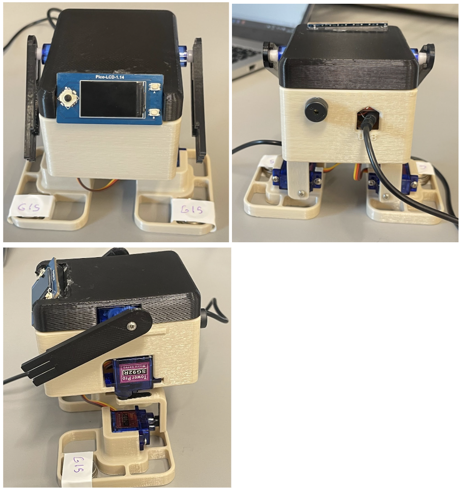
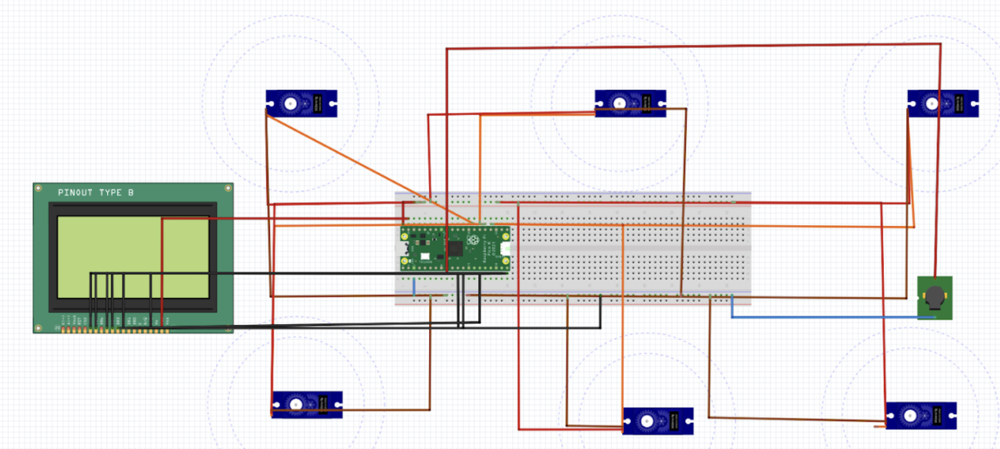
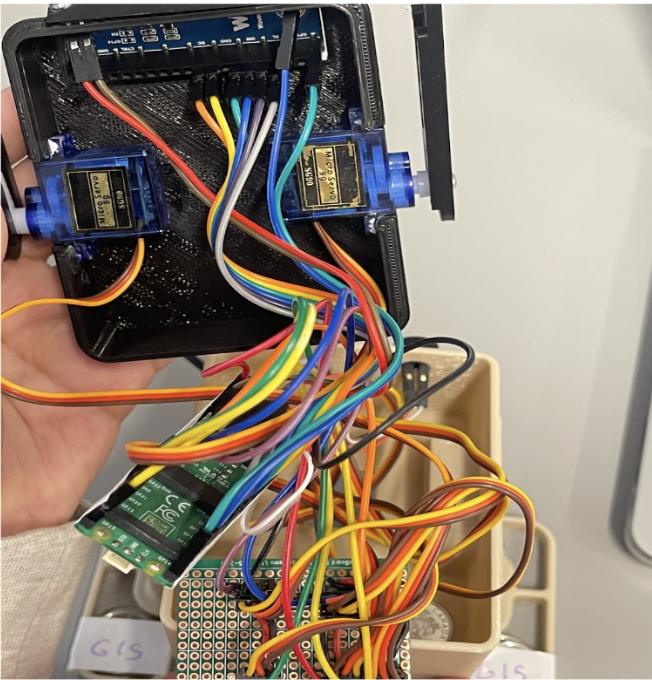
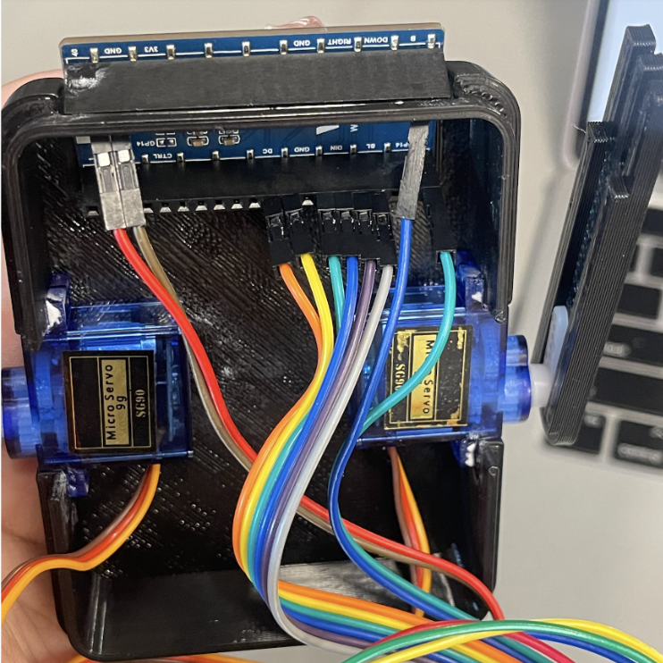

[![LinkedIn][linkedin-shield]][linkedin-url]

<!-- PROJECT LOGO -->

# Dancing Robert
An immersive project merging robotics with the rhythm of music, the Dancing Robot is a Raspberry Pi Pico-based creation that dances to tunes, driven by user selections on an LCD interface.

## Features

- **Synchronized Dance Moves**: Performs pre-programmed dance sequences in harmony with musical beats.
- **Interactive Interface**: LCD display to choose dance moves and monitor robot actions.
- **Integrated Control System**: Leverages Raspberry Pi Pico with CircuitPython for responsive and precise move execution.

## Technical Documentation

### Hardware Design and Implementation
- **Pico H**: Serves as the microcontroller unit for managing the dance sequences.
- **Piezo Buzzer**: Integrated to provide musical accompaniment to dance moves.
- **LCD Display**: Utilized for visual feedback and interaction, displaying dance moves and status.
- **Servo Motors**: Six motors enable the robot to execute precise dance movements.
- **3-D Printed Robot Parts**: Custom components for the robot's structure allowing for optimal movement and durability.

  

- **Protoboard**: Used to connect all electronic components and create a robust circuitry for the robot.

  

### Software Design
- **Dance Moves Programming**: Each dance move is defined as a separate function, which can be called on demand to perform the dance sequence.
- **LCD Interaction**: The LCD screen is programmed to display interactive elements such as blinking eyes and dance move names, enhancing the user experience.
- **Sound Synchronization**: The buzzer is programmed to play a series of notes corresponding to the dance moves, providing an auditory cue for each sequence.

### Implementation
The software is intricately designed to bring the Dancing Robot to life with six unique dance moves, each with distinct characteristics:

- **The Slide**: Simultaneously adjusts the robot's feet and leg angles to emulate a sliding step.
- **The Shuffle**: Alternates tiptoeing with leg angle changes for a shuffle dance.
- **The Twist**: Balances on one leg while transitioning weight to create a twisting motion.
- **The Step**: Simulates stepping movements in forward and backward directions.
- **The Hop**: Combines a seating motion with a gentle shaking to resemble a hop.
- **The Shake**: Varies feet angles to create a shaking dance effect.

Control of these dance moves is facilitated through different modes accessible via the interface:

- **Mode 0**: Idle with blinking eyes.
- **Modes 1-6**: Each mode corresponds to one of the six dance moves.
- **Mode 7**: Executes a sequence of all dance moves.

The user interface on the LCD display provides real-time selection and feedback of the dance moves, ensuring an engaging interaction with the robot.

## Usage
Once the setup is complete, the robot can be controlled via the LCD interface, allowing users to select and initiate different dance moves and songs.
<!-- CONTACT -->
## Contact

Yixi Lu - yixilu445@gmail.com

Project Link: [https://github.com/Chloeelu/GYM-Database-Management-System/tree/main]

(<a href="#readme-top">back to top</a>)

[linkedin-shield]: https://img.shields.io/badge/-LinkedIn-black.svg?style=for-the-badge&logo=linkedin&colorB=555
[linkedin-url]: https://www.linkedin.com/in/yixilu03/
[Next.js]: https://img.shields.io/badge/next.js-000000?style=for-the-badge&logo=nextdotjs&logoColor=white
